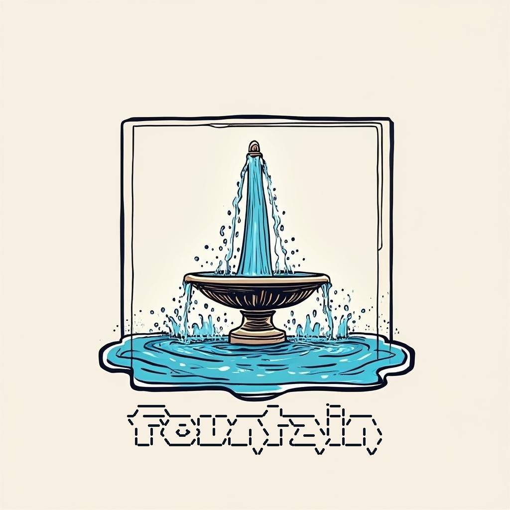

```
  _____                    __         .__
_/ ____\____  __ __  _____/  |______  |__| ____
\   __\/  _ \|  |  \/    \   __\__  \ |  |/    \
 |  | (  <_> )  |  /   |  \  |  / __ \|  |   |  \
 |__|  \____/|____/|___|  /__| (____  /__|___|  /
                        \/          \/        \/
```



# fountain

## 介绍

### 💧 Fountain：用仓颉语言重塑企业级 Web 开发

Fountain 是一个完全由 **仓颉编程语言（Cangjie 1.0）** 构建的企业级 Web 服务端框架。
它诞生的意义，不只是“又一个框架”，而是要回答一个更根本的问题：

> 当 Oracle 改变了 Java 的授权，当全球软件生态重新洗牌，我们是否能拥有属于自己的、真正开源且可控的编程语言与技术栈？

仓颉 1.0 的发布，标志着中国在语言层面拥有了一个图灵完备、编译器开源、生态正在成长的现代化语言。而我和我的团队正在为了这一伟大的使命而奋斗。
要让仓颉真正**走进复杂的产业级场景**发挥生产力，我们还缺一个关键环节，就是让仓颉真正的在一个足够复杂的场景中跑起来并稳定运行，在完成这个任务的过程中，仓颉的生态将会产生大量真实生产过程中的需求，生态会被不断完善，同样，这样一个项目也将成为仓颉走向成熟的呐喊。
为此，我们选择了众多行业领域中最艰难也极具价值的方向——**医疗核心系统（HIS、EMR、PACS等核心业务场景）**。
在这里，性能、可靠性与安全性缺一不可；在这里，仓颉和 Fountain 接受了最严苛的考验。

这次医疗行业的产业化试点由 **武汉开源创新中心（人工智能）技术专家委员会委员 吴京润（runningW）** 带领，
在 **江汉大学开源创新中心师生团队** 的全力支持下顺利进行。
从最初的构想到生产上线，经历了无数次需求验证、架构重构和深夜的调试，
Fountain 终于稳定运行在真实医疗环境中，成为仓颉语言应用落地的关键里程碑。

我们坚信——

> 背靠全产业链的雄厚国力，乘着国产替代如火如荼的东风，未来十年全球软件的中心一定在中国，仓颉和鸿蒙一定是最耀眼的星！
> 而技术的力量，不止在代码，更在共建。

如果你也希望看到 **开源技术在中国真正扎根、在行业中发光发热**，
欢迎加入我们，一起建设 Fountain，让更多领域的核心业务使用仓颉开发，让我们共同建设未来。

---

## Stargazers over time


## 各模块详细文档
### `fountain::f_app`
应用进程管理模块，可以用本模块加载使用fountain开发的应用项目动态链接库。
也可以使用`fountain::fountain.app`包使用本模块的同名API。
详情请见：<https://pkg.cangjie-lang.cn/package/fountain::f_app/1.1.0/readme>

### `fountain::f_aspect`
AOP
也可以使用`fountain::fountain.aspect`包使用本模块的同名API。
详情请见：<https://pkg.cangjie-lang.cn/package/fountain::f_aspect/1.1.0/>

### `fountain::f_base`
一些Iterator扩展，enum OS, 不需要使用unsafe就能获得字符串原始字节数组的字符串扩展, 不需要使用unsafe就能得到ArrayList原始数组的ArrayList扩展, extend Option, extend Array, extend Range, extend Number, extend String, extend ThreadLocal, HashBuilder, StringGenerator，etc.
也可以使用`fountain::fountain.base`包使用本模块的同名API。
详情请见：<https://pkg.cangjie-lang.cn/package/fountain::f_base/1.1.0/>

### `fountain::f_bean`
IOC
也可以使用`fountain::fountain.base`包使用本模块的同名API。
详情请见：<https://pkg.cangjie-lang.cn/package/fountain::f_bean/1.1.0/>

### `fountain::f_cache`
堆缓存
也可以使用`fountain::fountain.cache`包使用本模块的同名API。
详情请见：<https://pkg.cangjie-lang.cn/package/fountain::f_cache/1.1.0/>

### `fountain::f_cmd`
命令行工具
也可以使用`fountain::fountain.cmd`包使用本模块的同名API。
详情请见：<https://pkg.cangjie-lang.cn/package/fountain::f_cmd/1.1.0/>

### `fountain::f_codec`
编解码器
详情请见：<https://pkg.cangjie-lang.cn/package/fountain::f_codec/1.1.0/>

### `fountain::f_collection`
标准库尚不支持的集合以及一些标准库集合扩展
也可以使用`fountain::fountain.collection`包使用本模块的同名API。
详情请见：<https://pkg.cangjie-lang.cn/package/fountain::f_collection/1.1.0/>

### `fountain::f_concurrent`
负载均衡、限流算法、标准库尚不支持的并发集合和标准库并发集合扩展
也可以使用`fountain::fountain.concurrent`包使用本模块的同名API。
详情请见：<https://pkg.cangjie-lang.cn/package/fountain::f_concurrent/1.1.0/>

### `fountain::f_config`
配置模块
也可以使用`fountain::fountain.config`包使用本模块的同名API。
详情请见：<https://pkg.cangjie-lang.cn/package/fountain::f_config/1.1.0/>

### `fountain::f_crypto`
加密模块
也可以使用`fountain::fountain.crypto`包使用本模块的同名API。
详情请见：<https://pkg.cangjie-lang.cn/package/fountain::f_crypto/1.1.0/>

### `fountain::f_data`
数据复制模块，可以实现任意类实例之间同名公共成员变量、公共成员属性之间的复制。
可以随时得到指定名称的公共成员变量或属性的的值。
有各种数据验证注解，这些注解可以修饰公共成员变量或属性，也可以修饰函数参数，实现了复制时数据验证，MVC传参时也可以验证controller函数实参。
也可以使用`fountain::fountain.data`包使用本模块的同名API。
详情请见：<https://pkg.cangjie-lang.cn/package/fountain::f_data/1.1.0/>

### `fountain::f_egraph`
一个事件驱动的业务流程执行器
详情请见：<https://pkg.cangjie-lang.cn/package/fountain::f_egraph/1.1.0/>

### `fountain::f_exception`
异常模块
也可以使用`fountain::fountain.exception`包使用本模块的同名API。
详情请见：<https://pkg.cangjie-lang.cn/package/fountain::f_exception/1.1.0/>

### `fountain::f_http`
HTTP，目前实现了HTTP数据格式MediaType的定义和json、multipart/form-data的实现。
也可以使用`fountain::fountain.http`包使用本模块的同名API。
详情请见：<https://pkg.cangjie-lang.cn/package/fountain::f_http/1.1.0/>

### `fountain::f_httpclient`
HTTP客户端
也可以使用`fountain::fountain.httpclient`包使用本模块的同名API。
详情请见：<https://pkg.cangjie-lang.cn/package/fountain::f_httpclient/1.1.0/>

### `fountain::f_io`
IO
也可以使用`fountain::fountain.io`包使用本模块的同名API。
详情请见：<https://pkg.cangjie-lang.cn/package/fountain::f_io/1.1.0/>

### `fountain::f_jwt`
JWT
也可以使用`fountain::fountain.jwt`包使用本模块的同名API。
详情请见：<https://pkg.cangjie-lang.cn/package/fountain::f_jwt/1.1.0/>

### `fountain::f_log`
日志
也可以使用`fountain::fountain.log`包使用本模块的同名API。
详情请见：<https://pkg.cangjie-lang.cn/package/fountain::f_log/1.1.0/>

### `fountain::f_macros`
宏工具API
也可以使用`fountain::fountain.macros`包使用本模块的同名API。
详情请见：<https://pkg.cangjie-lang.cn/package/fountain::f_macros/1.1.0/>

### `fountain::f_mockdb`
mock database
也可以使用`fountain::fountain.mockdb`包使用本模块的同名API。
详情请见：<https://pkg.cangjie-lang.cn/package/fountain::f_mockdb/1.1.0/>

### `fountain::f_mvc`
MVC
也可以使用`fountain::fountain.mvc`包使用本模块的同名API。
详情请见：<https://pkg.cangjie-lang.cn/package/fountain::f_mvc/1.1.0/>

### `fountain::f_net`
事件驱动的网络通讯模块
也可以使用`fountain::fountain.net`包使用本模块的同名API。
详情请见：<https://pkg.cangjie-lang.cn/package/fountain::f_net/1.1.0/>

### `fountain::f_orm`
ORM
也可以使用`fountain::fountain.orm`包使用本模块的同名API。
详情请见：<https://pkg.cangjie-lang.cn/package/fountain::f_orm/1.1.0/>

### `fountain::f_pool`
一个池的实现，提供了对象池、数组池、ArrayList池
也可以使用`fountain::fountain.pool`包使用本模块的同名API。
详情请见：<https://pkg.cangjie-lang.cn/package/fountain::f_pool/1.1.0/>

### `fountain::f_process`
进展扩展模块
也可以使用`fountain::fountain.process`包使用本模块的同名API。
详情请见：<https://pkg.cangjie-lang.cn/package/fountain::f_process/1.1.0/>

### `fountain::f_protocol`
一个网络通讯协议实现
详情请见：<https://pkg.cangjie-lang.cn/package/fountain::f_protocol/1.1.0/>

### `fountain::f_random`
随机数扩展, ThreadLocalRandom, 蓄水池算法, 随机字符串
也可以使用`fountain::fountain.random`包使用本模块的同名API。
详情请见：<https://pkg.cangjie-lang.cn/package/fountain::f_random/1.1.0/>

### `fountain::f_regex`
正则表达式扩展、正则缓存、正则DSL
也可以使用`fountain::fountain.regex`包使用本模块的同名API。
详情请见：<https://pkg.cangjie-lang.cn/package/fountain::f_regex/1.1.0/>

### `fountain::f_rx`
反应式编程API
也可以使用`fountain::fountain.rx`包使用本模块的同名API。
详情请见：<https://pkg.cangjie-lang.cn/package/fountain::f_rx/1.1.0/>

### `fountain::f_security`
配合MVC使用的安全模块
也可以使用`fountain::fountain.security`包使用本模块的同名API。
详情请见：<https://pkg.cangjie-lang.cn/package/fountain::f_security/1.1.0/>

### `fountain::f_ticktock`
CRON定时器模块
也可以使用`fountain::fountain.ticktock`包使用本模块的同名API。
详情请见：<https://pkg.cangjie-lang.cn/package/fountain::f_ticktock/1.1.0/>

### `fountain::f_time`
标准库的时间API扩展
也可以使用`fountain::fountain.time`包使用本模块的同名API。
详情请见：<https://pkg.cangjie-lang.cn/package/fountain::f_time/1.1.0/>

### `fountain::f_util`
crc16/密钥交换协议/命名风格转换/常用设计模式/geohash/snowflake/UUID/murmur_hash/路径匹配/文本模板/树结构转换
也可以使用`fountain::fountain.util`包使用本模块的同名API。
详情请见：<https://pkg.cangjie-lang.cn/package/fountain::f_util/1.1.0/>

### `fountain::f_version`
应用与fountain的版本信息和应用BANNER
也可以使用`fountain::fountain.version`包使用本模块的同名API。
详情请见：<https://pkg.cangjie-lang.cn/package/fountain::f_version/1.1.0/>

### `fountain::fboot`
依赖fountain的应用项目启动程序，应用项目只需要编译为动态链接库，fboot会调用`fountain::f_app`完成应用启动。
详情请见：<https://pkg.cangjie-lang.cn/package/fountain::f_fboot/1.1.0/>
