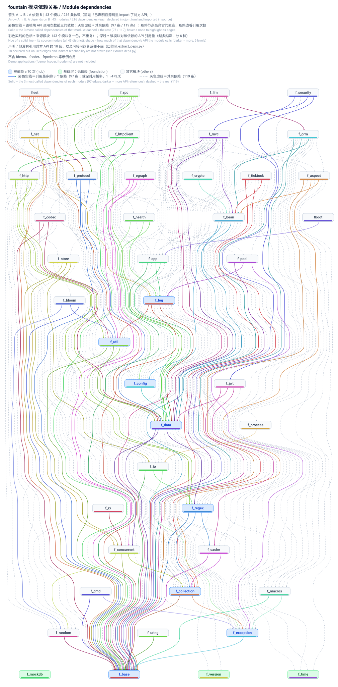
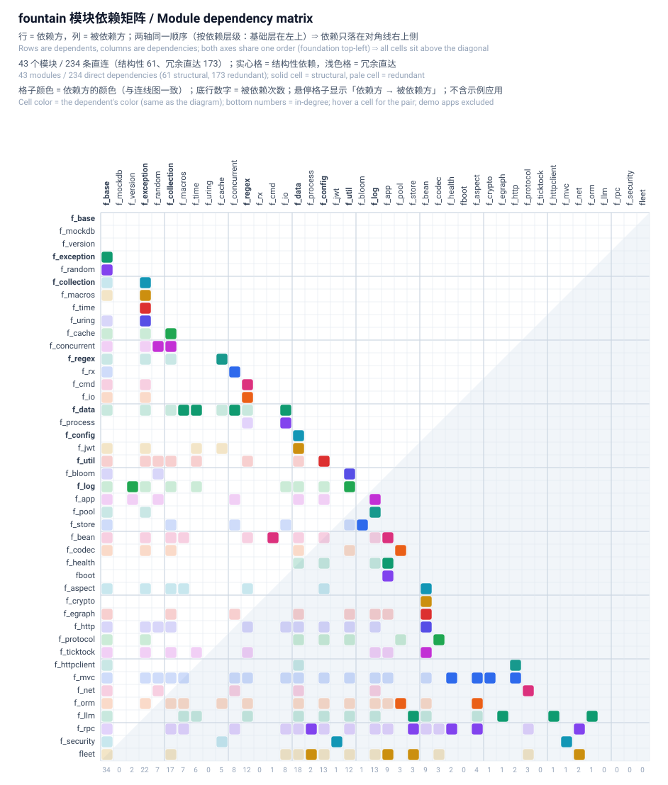

```
  _____                    __         .__
_/ ____\____  __ __  _____/  |______  |__| ____
\   __\/  _ \|  |  \/    \   __\__  \ |  |/    \
 |  | (  <_> )  |  /   |  \  |  / __ \|  |   |  \
 |__|  \____/|____/|___|  /__| (____  /__|___|  /
                        \/          \/        \/
```


# fountain

## Introduction

## Stargazers over time


## Demo Video

> 🎥 [Watch the full demo video](https://www.bilibili.com/video/BV1rtpT62Eaz/?vd_source=29618d9ddd46963c9eabd64d9e362fb4)


## STDX dependency
Configure the environment variable: `export CANGJIE_STDX_DYNAMIC_PATH=/path/to/dynamic_stdx`

### `fountain::fboot`
The launcher for application projects that depend on fountain. An application project only needs to be compiled into a dynamic
library, and fboot calls `fountain::f_app` to start the application.

**See details:**<https://gitcode.com/Cangjie-SIG/fountain/blob/master/fboot/README_en.md>


#### Installation
```bash
cjpm install fountain::fboot-a.b.c --root /path/to/install # replace a.b.c with the actual version number
export PATH=$PATH:/path/to/install/bin
export LD_LIBRARY_PATH=$LD_LIBRARY_PATH:/path/to/install/libs/fboot
```
#### Startup
```bash
fboot run --dylibPattern=<REGEX_OF_PROJECT_DYLIB_FILENAMES> # see the boot.sh script of the project's fdemo module for details
# dylibPattern can also be defined as an environment variable, eg.
# export dylibPattern=<REGEX_OF_PROJECT_DYLIB_FILENAMES>
```
#### Creating a project and adding dependencies
After installing `fboot`, you can run `fboot workspace` to initialize the current directory as a Cangjie workspace project; see the `fboot` documentation for details.
Any module the project needs is added to the cjpm.toml in the project root directory. Take `f_base` as an example:
```bash
fboot workspace <workspace_name> # Omit <workspace_name> to create a workspace at the current working path, which must then be empty
# Automatically adds the dependencies fountain::f_base and fountain::f_version with version 1.0.0
# The automatically added dependencies match the fboot version
# Automatically adds the stdx dependencies; define the environment variable CANGNJIE_STDX_DYNAMIC_PATH yourself
cd <workspace_name>
fboot module <module_name> # Create a dynamic library module
fboot help # Display the other features of fboot
```
```toml
[dependencies]
# Make a.b.c the same as `fboot version`
"fountain::f_base" = "a.b.c" 
"fountain::f_version" = "a.b.c"
```

## Module dependencies

The diagram below shows the dependencies between fountain modules (the arrow `A → B` means A depends on B;
green boxes are the foundation modules that depend on nothing, blue boxes are the most depended-upon modules.
The demo applications `fdemo`, `fcoder` and `frpcdemo` are not included):



The matrix below is the same data in another reading — handy for lookups such as "what does X depend on / who depends on X"
(rows are dependents, columns are dependencies, both axes share the same order; solid cells are structural dependencies,
pale cells are the redundant direct ones):



The generators and how to redraw the diagrams: see [`docs/模块依赖图`](docs/模块依赖图/README.md).

## Detailed documentation of each module
### `fountain::f_app`
Application process management module; this module can load application projects developed with fountain as dynamic libraries.
You can also use the same-named APIs of this module through the `fountain::fountain.app` package.

**See details:**<https://gitcode.com/Cangjie-SIG/fountain/blob/master/f_app/README_en.md>

### `fountain::f_aspect`
AOP
You can also use the same-named APIs of this module through the `fountain::fountain.aspect` package.

**See details:**<https://gitcode.com/Cangjie-SIG/fountain/blob/master/f_aspect/README_en.md>

### `fountain::f_base`
Some Iterator extensions, enum OS, string extensions to get the raw byte array of a string without unsafe, ArrayList extensions to get the raw
array of an ArrayList without unsafe, extend Option, extend Array, extend Range, extend Number, extend String, extend ThreadLocal, HashBuilder, StringGenerator, etc.
You can also use the same-named APIs of this module through the `fountain::fountain.base` package.

**See details:**<https://gitcode.com/Cangjie-SIG/fountain/blob/master/f_base/README_en.md>

### `fountain::f_bean`
IOC
You can also use the same-named APIs of this module through the `fountain::fountain.base` package.

**See details:**<https://gitcode.com/Cangjie-SIG/fountain/blob/master/f_bean/README_en.md>

### `fountain::f_cache`
Heap cache
You can also use the same-named APIs of this module through the `fountain::fountain.cache` package.

**See details:**<https://gitcode.com/Cangjie-SIG/fountain/blob/master/f_cache/README_en.md>

### `fountain::f_cmd`
Command line tools
You can also use the same-named APIs of this module through the `fountain::fountain.cmd` package.

**See details:**<https://gitcode.com/Cangjie-SIG/fountain/blob/master/f_cmd/README_en.md>

### `fountain::f_codec`
Codec

**See details:**<https://gitcode.com/Cangjie-SIG/fountain/blob/master/f_codec/README_en.md>

### `fountain::f_collection`
Collections not yet supported by the standard library, plus some standard library collection extensions
You can also use the same-named APIs of this module through the `fountain::fountain.collection` package.

**See details:**<https://gitcode.com/Cangjie-SIG/fountain/blob/master/f_collection/README_en.md>

### `fountain::f_concurrent`
Load balancing, rate limiting algorithms, concurrent collections not yet supported by the standard library, and standard library concurrent collection extensions
You can also use the same-named APIs of this module through the `fountain::fountain.concurrent` package.

**See details:**<https://gitcode.com/Cangjie-SIG/fountain/blob/master/f_concurrent/README_en.md>

### `fountain::f_config`
Configuration module
You can also use the same-named APIs of this module through the `fountain::fountain.config` package.

**See details:**<https://gitcode.com/Cangjie-SIG/fountain/blob/master/f_config/README_en.md>

### `fountain::f_crypto`
Cryptography module
You can also use the same-named APIs of this module through the `fountain::fountain.crypto` package.

**See details:**<https://gitcode.com/Cangjie-SIG/fountain/blob/master/f_crypto/README_en.md>

### `fountain::f_data`
Data copying module, which can copy public member variables and public member properties with the same name between instances of any classes.
The value of a public member variable or property with a given name can be obtained at any time.
It provides various data validation annotations that can decorate public member variables or properties as well as function parameters, implementing
data validation during copying; they can also validate the actual arguments of controller functions when MVC passes parameters.
You can also use the same-named APIs of this module through the `fountain::fountain.data` package.

**See details:**<https://gitcode.com/Cangjie-SIG/fountain/blob/master/f_data/README_en.md>

### `fountain::f_exception`
Exception module
You can also use the same-named APIs of this module through the `fountain::fountain.exception` package.

**See details:**<https://gitcode.com/Cangjie-SIG/fountain/blob/master/f_exception/README_en.md>

### `fountain::f_http`
HTTP; currently it implements the definition of the HTTP data format MediaType and the json and multipart/form-data implementations.
You can also use the same-named APIs of this module through the `fountain::fountain.http` package.

**See details:**<https://gitcode.com/Cangjie-SIG/fountain/blob/master/f_http/README_en.md>

### `fountain::f_httpclient`
HTTP client
You can also use the same-named APIs of this module through the `fountain::fountain.httpclient` package.

**See details:**<https://gitcode.com/Cangjie-SIG/fountain/blob/master/f_httpclient/README_en.md>

### `fountain::f_io`
IO
You can also use the same-named APIs of this module through the `fountain::fountain.io` package.

**See details:**<https://gitcode.com/Cangjie-SIG/fountain/blob/master/f_io/README_en.md>

### `fountain::f_jwt`
JWT
You can also use the same-named APIs of this module through the `fountain::fountain.jwt` package.

**See details:**<https://gitcode.com/Cangjie-SIG/fountain/blob/master/f_jwt/README_en.md>

### `fountain::f_log`
Logging
You can also use the same-named APIs of this module through the `fountain::fountain.log` package.

**See details:**<https://gitcode.com/Cangjie-SIG/fountain/blob/master/f_log/README_en.md>

### `fountain::f_macros`
Macro utility API
You can also use the same-named APIs of this module through the `fountain::fountain.macros` package.

**See details:**<https://gitcode.com/Cangjie-SIG/fountain/blob/master/f_macros/README_en.md>

### `fountain::f_mockdb`
mock database
You can also use the same-named APIs of this module through the `fountain::fountain.mockdb` package.

**See details:**<https://gitcode.com/Cangjie-SIG/fountain/blob/master/f_mockdb/README_en.md>

### `fountain::f_mvc`
MVC
You can also use the same-named APIs of this module through the `fountain::fountain.mvc` package.

**See details:**<https://gitcode.com/Cangjie-SIG/fountain/blob/master/f_mvc/README_en.md>

### `fountain::f_net`
Event-driven network communication module
You can also use the same-named APIs of this module through the `fountain::fountain.net` package.

**See details:**<https://gitcode.com/Cangjie-SIG/fountain/blob/master/f_net/README_en.md>

### `fountain::f_orm`
ORM
You can also use the same-named APIs of this module through the `fountain::fountain.orm` package.

**See details:**<https://gitcode.com/Cangjie-SIG/fountain/blob/master/f_orm/README_en.md>

### `fountain::f_pool`
An implementation of pools, providing object pools, array pools and ArrayList pools
You can also use the same-named APIs of this module through the `fountain::fountain.pool` package.

**See details:**<https://gitcode.com/Cangjie-SIG/fountain/blob/master/f_pool/README_en.md>

### `fountain::f_process`
Process extension module
You can also use the same-named APIs of this module through the `fountain::fountain.process` package.

**See details:**<https://gitcode.com/Cangjie-SIG/fountain/blob/master/f_process/README_en.md>

### `fountain::f_protocol`
An implementation of a network communication protocol

**See details:**<https://gitcode.com/Cangjie-SIG/fountain/blob/master/f_protocol/README_en.md>

### `fountain::f_random`
Random number extensions, ThreadLocalRandom, reservoir sampling algorithm, random strings
You can also use the same-named APIs of this module through the `fountain::fountain.random` package.

**See details:**<https://gitcode.com/Cangjie-SIG/fountain/blob/master/f_random/README_en.md>

### `fountain::f_regex`
Regular expression extensions, regex cache, regex DSL
You can also use the same-named APIs of this module through the `fountain::fountain.regex` package.

**See details:**<https://gitcode.com/Cangjie-SIG/fountain/blob/master/f_regex/README_en.md>

### `fountain::f_rx`
Reactive programming API
You can also use the same-named APIs of this module through the `fountain::fountain.rx` package.

**See details:**<https://gitcode.com/Cangjie-SIG/fountain/blob/master/f_rx/README_en.md>

### `fountain::f_security`
Security module used together with MVC
You can also use the same-named APIs of this module through the `fountain::fountain.security` package.

**See details:**<https://gitcode.com/Cangjie-SIG/fountain/blob/master/f_security/README_en.md>

### `fountain::f_ticktock`
CRON timer module
You can also use the same-named APIs of this module through the `fountain::fountain.ticktock` package.

**See details:**<https://gitcode.com/Cangjie-SIG/fountain/blob/master/f_ticktock/README_en.md>

### `fountain::f_time`
Time API extensions for the standard library
You can also use the same-named APIs of this module through the `fountain::fountain.time` package.

**See details:**<https://gitcode.com/Cangjie-SIG/fountain/blob/master/f_time/README_en.md>

### `fountain::f_util`
crc16/key exchange protocol/naming style conversion/common design patterns/geohash/snowflake/UUID/murmur_hash/path matching/text
template/tree structure conversion
You can also use the same-named APIs of this module through the `fountain::fountain.util` package.

**See details:**<https://gitcode.com/Cangjie-SIG/fountain/blob/master/f_util/README_en.md>

### `fountain::f_version`
Version information of the application and fountain, and the application BANNER
You can also use the same-named APIs of this module through the `fountain::fountain.version` package.

**See details:**<https://gitcode.com/Cangjie-SIG/fountain/blob/master/f_version/README_en.md>

### `fountain::f_egraph`
Event-driven flow library

**See details:**<https://gitcode.com/Cangjie-SIG/fountain/blob/master/f_egraph/README_en.md>

### `fountain::f_llm`
Large model development library based on `fountain::f_egraph`

**See details:**<https://gitcode.com/Cangjie-SIG/fountain/blob/master/f_llm/README_en.md>

### `fountain::f_store`
An LSM-TREE key-value store based on `fountain::f_collection.ConcurrentSkipListMap` and `fountain::f_io.SegmentedLog`.
Every create/read/update/delete operation is guaranteed to be atomic. It also supports iterators for KEY prefix traversal.

**See details:**<https://gitcode.com/Cangjie-SIG/fountain/blob/master/f_store/README_en.md>

### `fountain::fleet`
A data synchronization service based on `fountain::f_store`, `fountain::f_codec`, `fountain::f_net` and `fountain::f_protocol`.
It can be used for service registration, configuration centers, metadata registration, and so on.

**See details:**<https://gitcode.com/Cangjie-SIG/fountain/blob/master/fleet/README_en.md>

### `fountain::f_rpc`
RPC implementation with service self-registration and discovery, implementing load balancing, service node weights, heartbeat keep-alive, etc.

**See details:**<https://gitcode.com/Cangjie-SIG/fountain/blob/master/f_rpc/README_en.md>
